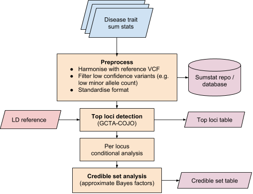

Finemapping pipleine
====================

Finemapping pipeline for Open Targets Genetics. The pipeline is currently bespoke to the Neale lab UK Biobank summary statistics (version 1) and must be run on a cluster using `bsub`.

A generalised finemapping/colocalisation pipeline is under development ([analysis plan](https://docs.google.com/document/d/1m2XFvovzXtFKoH9J-aZriH69k54Wa5cYwQJEh7VrJAs/edit?usp=sharing)).

### Contents
- [Requirements](#requirements)
- [Usage](#usage)
- [Methods](#methods)

### Requirements
- GCTA >= v1.91.3 (there is a bug in v1.91.2b which causes GCTA slct to produce unexpected results)
- `conda`

### Usage

```
# Install dependencies into isolated environment
conda env create -n finemapping --file environment.yaml

# Activate environment
source activate finemapping

# Alter configuration file
nano configs/config.yaml

# Execute steps sequentially (on cluster using BSUB)
bsub < 1a.define_loci.bsub_wrapper.sh
bsub < 2a.finemap_loci_multisig.bsub_wrapper.sh
bsub -J collate_results -n 4 -q normal -R "select[mem>16000] rusage[mem=16000] span[hosts=1]" -M16000 snakemake -s 3.collate_finemapping_results.Snakefile --cores 4

```

### Methods

#### Overview



#### Summary statistic preparation

- Summary statistics were preprocessed following the criteria outline [here](https://github.com/opentargets/sumstat_data)
- Allele / effect direction harmonisation scripts can be found [here](https://github.com/opentargets/sumstat_harmoniser)

#### Top loci detection

Independently associated top loci will be detected with GCTA stepwise selection procedure (cojo-slct) using UK10K (ALSPAC + TwinsUK) genotypes (N=3,781) as an LD reference. Index variants (top variant at each locus) will be kept if both the conditional and nominal p-values are less than 1e-5.

Variants in the MHC region were pre-filtered (6:28477797–33448354 GRCh37).

#### Per locus conditional analysis

Where multiple index SNPs are found at the same locus (within 500kb of each other), perform GCTA single-variant association analysis conditional on other index SNPs at the locus.

#### Credible set analysis

Credible set analysis is to be conducted for each associated locus using the above conditional summary statistics. For all variants in a region around the index variant (±500kb), calculate approximate Bayes factors (ABF). ABFs are currently calculated using the `approx.bf.p` [method](https://github.com/chr1swallace/coloc/blob/master/R/claudia.R#L67) re-implemented from the coloc package. The python implementation from our current finemapping pipeline can be seen here. Variants are ordered by their posterior probabilities (PP) and sequentially added to the credible set until the cumulative sum is >0.95 (95% credible set).
